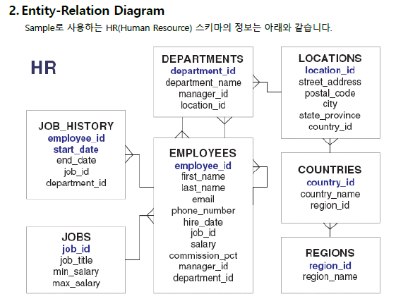

# 오라클 데이터베이스

* 자바는 프로그래밍 언어로 컴퓨터에서 다목적 프로그램을 제작한다.

* 이때 데이터들이 발생하는데 이를 영구적인 파일/데이터베이스에 저장할 필요가 있다.

* 파일

  1) 데이터 분리 기준이 없다.

  2) 데이터 타입 기준이 없다.

  3) 특정 위치 데이터에 접근 불가능

  4) 중복 데이터 가능

  5) 데이터 상태 모순

```
100 김사원 500.0
200 홍사원 540.1
300 오사원 650.2
```

* 데이터베이스

  1) 의미있는 데이터의 모음

```
학생 = (학번 이름 전공 학교명 학년 성적)
회사원 = (사번 이름 부서 회사명 직급 급여)
```

* 데이터베이스 표현방법
  * 계층형
  * 네트워크형
  * 관계형 / 객체관계형 데이터베이스
* 데이터베이스 표현 툴 (종류)
  * Oracle / mysql / ms sqlserver / db2 / ...

* 관계형 데이터베이스 (Relational DB -  RDB)
  * 데이터 관계를 행과 열의  테이블 구조로 표현
  * 열(COLUMN) - 데이터의 구성요소 1개 표현 단위
  * 행(Row) - 1개의 데이터 (Record)

학생 테이블

| 학번<br />정수 세자리<br />중복 X | 이름<br />문자 10자리 | 성적<br />실수 5자리(소수 2자리) |
| --------------------------------- | --------------------- | -------------------------------- |
| 100                               | 이학생                | 4.5                              |
|                                   |                       |                                  |
|                                   |                       |                                  |

* 관계형 데이터베이스 내 작업
  * 테이블 생성 - 삭제
  * 데이터 1개 Row 저장 - 삭제
  * 데이터 조회
  * 함수 사용

* 관계형 데이터베이스 활용 문법 언어
  * SQL

  1) RDB 제품 종류에 관계없이 사용할 수 있는 표준 SQL

  +

  2) 각 RDB마다 독자적 SQL 

## 오라클

* Run SQL Command Line
  * connect system/암호
    * Connected

| 데이터베이스(xe) | system schema(스키마 = 계정)<br />(super user) | 테이블                         |
| ---------------- | ---------------------------------------------- | ------------------------------ |
|                  | hr (기본 생성/ 잠금되어있음)                   | 테이블 조회 실습               |
|                  | 계정 생성                                      | 테이블들 생성<br />데이터 저장 |

* system 이라는 스키마에 접속해야 테이블들을 볼 수 있고, hr 스키마에 접속해야 그 내부의 테이블을 볼 수 있다.
* oracle 11g express edition
  * 무료, 크기 제한, 1개만 사용 ( 교육용 )
  * enterprise / standard edition > 유료, 크기제한x , 여러개 사용

### SQL 입력, 실행 툴

1) Run SQL Command Line

2) SQL Developer / Orange / Toad / Eclipse Data Explorer

* 1) 에서의 명령어 (oracle의 독자적 sql)
  * oracle에서는 4글자 축약형을 제공한다.
  * 대소문자 구분이 없다.
    * 단, 암호나 단일 문자데이터는 대소문자를 구분한다.

```sql
SQL>connect system/암호 
SQL>conn system/암호

SQL>disconnect
SQL>disconn

SQL>connect system/암호
SQL>alter user hr identified by hr account unlock;
# super 유저에서만 hr계정의 잠금을 해제할 수 있음

SQL>connect hr/hr  # disconnect 안하고 이동시 기존 스키마 자동 disconnect
hr 테이블의 실습이 가능
SQL>select * from tab;
SQL>set pagesize 100; #페이지 크기
SQL>set linesize 150; #라인사이즈
```

### SQL 종류

* 테이블 생성 - 변경 - 삭제
* Data Definition Language
* 데이터 저장 구조 정의언어 = **DDL**
  * 학번 --> ID NUMBER(5)
* 테이블의 데이터 저장 - 수정 - 삭제
* 데이터 조작 언어 = **DML**

* 계정 생성 - DB접속 허용 SQL
  * System 계정
  * Data Controll Language
  * 데이터 제어어 = **DCL**
* 트랜잭션 제어 언어
  * Transaction controll language > **TCL**

* Data Query Language = **DQL** (조회)

| DDL  | create table ...<br />alter table ...<br />drop table ... |
| ---- | --------------------------------------------------------- |
| DML  | insert ...<br />update ...<br />delete                    |
| DCL  | grant, revoke<br />새로운 계정 생성 시 사용               |
| TCL  | commit<br />rollback                                      |
| DQL  | select                                                    |

### SQL 사용 방법



* hr 8개 테이블 조회 실습

```
conn hr/hr
select * from tab; # 테이블 목록 조회

desc 테이블명;
>> 테이블 컬럼명 타입 갯수
select 조회컬럼, 조회컬럼 from 테이블명;
select * from employees;
```

* select 조회column from 테이블명;
* **select ~ from**(필수) ~ where ~ group by ~ having ~ order dy

* ex) employees 테이블에서 first_name 열 조회
  * select first_name from employees;

</br>

* 급여 컬럼 - salary;
  * 연봉 = 급여 * 12 ( 숫자 타입이므로 연산이 가능하다. )

```sql
select first_name, salary from employees;
select salary*12 from employees;
```

* 실제컬럼명을 조회, 이름 임시 변경 - alias (as)

```sql
select first_name as 이름, salary as 월급, salary*12 as 연봉 from employees;
```

* employees 107명 사원 정보 저장
  * 직종 코드를 출력, 중복되지 않게 한번만 출력하고 싶다면?
  * **distinct**

```sql
select job_id from employees; # 107개 출력
select distinct job_id from employees; # 중복값 제거되어 출력
```

* Oracle 에서 내용을 모두 대문자로 출력하는 방법	
  * **upper(컬럼명)**

```sql
select first_name, upper(first_name) from employees;
```

```sql
select 컬럼명1, 컬럼명2, ... | * | 컬럼명 as 별명 | distinct | 산술연산자 | 함수
from
where
group by
having
order by
```

* employees 테이블에서 salary 가 10000 이상인 사원의 이름과 급여 조회
  * 비교연산자는 들어갈 수 없기에 **where** 절 사용

```sql
select first_name, salary from employees where salary >= 10000;
```

### 연산자

| 산술연산자      | +, -, *, /                                                   |
| --------------- | ------------------------------------------------------------ |
| 비교연산자      | >, >=, <, <=, !=(<>), =                                      |
| 논리연산자      | not, and, or                                                 |
| 목록연산자      | in (...)                                                     |
| 유사연산자      | like 'ABC%'<br />% >> 모든 문자, 갯수 상관없다(0개여도 된다)<br />_ >> 모든 문자 1개 |
| 범위연산자      | between ~ and                                                |
| null처리 연산자 | is null<br />is not null                                     |

* 결과가 나온 후 edit
  * 바로 직전에 실행한 sql의 수정이 필요할 경우
  * **edit > 메모장에서 수정 > / 입력**

* 목록연산자 / 범위연산자 사용 예

```sql
select employee_id, first_name from employees
where employee_id = 50 or employee_id = 100 or employee_id = 150 or employee_id =200 or employee_id = 250 or employee_id = 300;

# 간단하게 표현 (목록 연산자)
select employee_id, first_name from employees
where employee_id in(50, 100, 150, 200, 250, 300);

select first_name, hire_date from employees
where hire_date between '05/01/01' and '05/12/31';
```

* 유사연산자 사용 예

```sql
select first_name
from employees
where first_name like 'J%'; // J로 시작하는 이름의 사람을 찾음

where first_name like '%r'; // r로 끝나는이름의 사람을 찾음

where first_name like '%er%'; // er로 시작하던 끝나던 중간에 끼어있던 문자를 찾음

where job_id like '___\_MAN' // _MAN으로 끝나는 직종을 찾는다.
```

* 문자열을 사용할 때 ' '  사용(단일따옴표)

* employees 테이블 job_id 컬럼에서 manager 직종 조회

```sql
select job_id from employees
where job_id like '%MAN';
```

* employees 테이블의 이름, hire_date (입사일) 을 조회하되, 입사년도가 05년 이후 조회

```sql
select hire_date from employees; >> 기본 데이터타입과 포맷 확인

select first_name, hire_date 
from employees 
where hire_date like '05%';
```

* 타입 / 데이터 형태 저장
  * **desc employees;**
    * employees를 구성하는 컬럼들의 타입을 알려준다.

* **select sysdate from dual** - 오라클 내장 포맷 / 포맷 변경 가능

```sql
select sysdate from dual; # 현재 시스템 날짜 시각 정보
rr/mm/dd 로 표현
rr 값 -> 0-49값 2000년대
	    50-99값 1900년대를 표현
```

## Order by

* 데이터를 오름차순, 내림차순으로 정렬한다.

```sql
select first_name from employees order by first_name asc; // 오름차순
select first_name from employees order by first_name desc; // 내림차순

select salary from employees order by salary asc; // 오름차순
select salary from employees order by salary desc; // 내림차순

select first_name, salary from employees order by salary asc, first_name desc;
// 

select first_name, salary from employees order by salary asc, first_name desc;

select hire_date from employees order by hire_date [asc];

select hire_date, first_name from employees order by 1,2;
// hire_date로 먼저 정렬, 이후 first_name으로 다시 정렬

order by 컬럼명 or index or alias [asc] desc;
```

* 이때 asc는 생략 가능, desc는 생략 불가능

</br>

* 입사일 컬럼 - hire_date
* 입사년 컬럼 X , 입사일 컬럼 X
* 입사월이 6월인 사원의 이름, 급여, 입사일을 조회되게 출력하되, 입사일이 가장 최근인 사원부터 조회하시오

```sql
select first_name, salary, hire_date from employees
where hire_date like '%/06/%' (또는 '___06%' 또는 '___06___' 등)
order by hire_date; /(또는 3)
```

* employees 테이블의 commission_pct 컬럼 조회

```sql
select commission_pct from employees
order by 1 desc;
```

* 빈 칸이 많이 나오게 된다.

* 오라클에서는 모든 타입의 데이터 값이 없으면 null - 공백
* null값은 정렬 기준에서 가장 마지막에 위치한다.
* employees 테이블의 commission_pct 컬럼에서 조회값이 있는 데이터만 조회한다. (null 제외)

```sql
select commission_pct from employees
where commission_pct = ''; >> 불가능

>> commission_pct의 Type > NUMBER(2,2) >> 0을 표시하지않는다?
>> ''은 숫자타입과 함께 사용할 수 없다.

>> null 을 표현하는 방법
where commission_pct is null; // null만 가져온다.
where commission_pct is not null;

```

</br>

* 최근에 입사한 5명을 조회하라
* hire_date 입사일자를 desc로 정렬해 조회
* **rownum** > 조회하는 행번호를 출력해준다.

```sql
select rownum, hire_date from employees
where rownum <= 5
order by 2 desc;
```

| 작성순서                                  | 실행순서                                                     |
| ----------------------------------------- | ------------------------------------------------------------ |
| select<br />from<br />where<br />order by | from 테이블을 찾는다.<br />where 조건에 맞는 레코드를 찾는다.<br />select 컬럼 조회<br />order by 조회한 컬럼의 순서를 정렬한다. |

* 위 코드와 같이 작성하면 순서가 뒤죽박죽 섞이게 된다.

### subquery

* select 안에 또다른 select 설정
* top-n Query (top n개의 쿼리 추출)
  * 가장 외부의 메인쿼리 / 내부의 서브쿼리 (먼저 수행된다.)

```sql
select rownum, hire_date
from (select * from employees order by hire_date desc) >> 가장 먼저 수행된다.
where rownum <= 5;
```

</br>

* departments 테이블 내 department_name 컬럼
* Sales 부서에 근무하는 사원의 이름 조회

```sql
select first_name
from employees
where department_name = 'Sales'; >>> 불가능

select * from departments
where department_name = 'Sales';

select department_id from employees
where department_id = 80;

select first_name, department_id from employees
where department_id = (select department_id from departments where department_name = 'Sales'); >> 다른 테이블에서의 조건을 불러옴
```

| employees 테이블  | departments 테이블                                |
| ----------------- | ------------------------------------------------- |
| 100 이사원 ... 80 | 10 총무부<br />20 인사부<br />....<br />80 교육부 |

</br>

* 문제 ) Susan과 같은 부서에 근무하는 사원의 직종과 급여 조회
  * job_id 직종
  * salary 급여
  * first_name 이름 > 모두 employees 테이블에 위치
  * department_id

```sql
select job_id, salary
from employees
where department_id = 
		(select department_id from employees where first_name = 'Susan');
// 내 부서 = 이름이 Susan인 사람의 부서

```

* 문제 ) William과 같은 직종을 가진 사원의 부서, 급여 조회 (William 은 두명이다.)

```sql
select department_id, salary
from employees
where job_id = 
		(select job_id from employees where first_name = 'William');
// 서브쿼리의 job_id 가 두개 나오기 때문에 출력이 되지 않는다.
// 따라서 다음과 같이 사용한다.

select department_id, salary, job_id
from employees
where job_id in (select job_id from employees where first_name = 'William');
```

* 서브쿼리의 결과가 **여러 결과를 리턴하는 경우** **in**을 사용한다.
  * 사실 하나의 결과만을 반환한다 해도 **in** 을 사용하는 것이 편리하다.
* 단 **하나만의 결과만을 반드시 반환해야할 경우에는 = 을 사용**한다.

* 문제 ) Susan보다 더 급여를 많이 받는 사원의 사번, 이름, 급여 조회

```sql
select employee_id, first_name, salary
from employees
where salary > (select salary from employees where first_name = 'Susan');
```

* 이때 william 로 변경한다면?

```sql
select employee_id, first_name, salary
from employees
where salary >= all (또는 any)
(select salary from employees where first_name = 'William');
```

ex) 6500, 1000, 3000

1) 모든 William의 급여와 같거나 많을 때

* 6500보다 같거나 많을 때 ( 최대값보다 크거나 많을 때 >= **all**)

2) 1명의 william 급여와 같거나 많을 때

* 1000 같거나 많을 때 ( 최소값보다 같거나 많을 때 >= **any** )

### 정리

* 서브쿼리
  * select .. (select ... ) 
* 단일행 리턴
  *  = , > , >= , <, <=, != (비교 연산자)
* 다중행 리턴
  * = -> IN
  * != -> NOT IN
  * \> -> all
  * `> -> any

* select sysdate from dual;
  * 오늘의 날짜
  * sysdate+1 내일
  * sysdate-1 어제
  * sysdate - hire_date 근무 일수


1. 2002년 이후에 입사한 직원들 중에서 급여가 13000 이상 20000 이하인 직원들의 이름, 급여, 부서id, 입사일을 조회하시오.

```sql
select first_name, salary, department_id, hire_date
from employees
where hire_date >= '02/01/01' and salary between 13000 and 20000;
```


2. 근무한지 10년이 넘은 사원의 이름과 근무년수를 조회하시오. 

```sql
select first_name as 이름, (sysdate - hire_date)/365 as 근무년수
from employees
where sysdate-hire_date >= 365*10;
```

3. 직원 중에서 상관이 없는 직원의 이름과 급여를 조회하시오.
   상관의 정보는 manager_id 컬럼에 있습니다.

```sql
select first_name, salary
from employees
where manager_id is null;
```

4. 10, 50 번 부서에 속해있으면서 급여가 13000 이상인 직원의 이름, 급여, 부서id를 조회하시오.

```sql
select first_name, salary, department_id
from employees
where department_id in (10,50) and salary >= 13000; //// 다시 해결해보기
```

5. 직종이 clerk 직종인 직원의 이름, 급여, 직종코드를 조회하시오.
   (clerk 직종은 job_id에 CLERK을 포함하거나
   CLERK으로 끝난다.)

```sql
select first_name, salary, department_id
from employees
where job_id like '%CLERK%';
```

6. 12월에 입사한 직원의 이름, 급여, 입사일을 조회하시오.

```sql
select first_name, salary, hire_date
from employees
where hire_date like '%/06/%';
```

7. 이름이 m으로 끝나는 직원의 이름, 급여, 입사일을 조회하시오.

```sql
select first_name, salary, hire_date
from employees
where first_name like '%m';
```

8. 이름의 세번째 글자가 d인 이름, 급여, 입사일을 조회하시오.

```sql
select first_name, salary, hire_date
from employees
where first_name like '__d%';
```

9. 커미션을 받는 직원의 이름, 커미션, 총급여를 조회하시오.
   총급여는 커미션*급여로 계산합니다

```sql
select first_name, commission_pct, commission_pct*salary as 총급여
from employees
where commission_pct is not null;
```

10. 커미션을 받지 않는 직원의 이름, 급여를 조회하시오.

```sql
select first_name,salary
from employees
where commission_pct is null;
```

11. 10월에 입사해서 30, 50, 80 번 부서에 속해있으면서, 
    급여를 5000 이상 17000 이하를 받는 직원을 조회하시오. 
    단, 커미션을 받지 않는 직원들은 검색 대상에서 제외시키며, 먼저 입사한 직원이 
    먼저 출력되어야 하며 입사일이 같은 경우 급여가 많은 직원이 먼저 출력되록 하시오.

```sql
select first_name, salary, hire_date, department_id
from employees
where 
hire_date like '%/10/%' 
and department_id in(30,50,80) 
and salary >= 5000 and salary <= 17000 
and commission_pct is not null
order by hire_date, salary desc;
```

12. jobs 테이블
    job_id : 직종코드
    job_title : 직종명
    max_salary : 해당직종 최대급여
    min_salary : 해당직종 최소급여

    jobs 테이블에서 회장과 부회장의 직종명, 최소급여,최대급여를 조회하시오.

    job_title은 직종명이고 회장은 president, 부회장은 vise president를 포함합니다. // 부회장 출력 불가능?

```sql
select job_title, min_salary, max_salary
from jobs
where job_title = 'President' or job_title ='%Vise President';

select job_title, min_salary, max_salary
from jobs
where job_title in ('President', '%Vise President');
```

13. countries 테이블
    country_id : 국가코드
    country_name : 국가이름

    countries 테이블에서 국가이름이 United Kingdom 인 국가의 국가코드를 조회하시오.

```sql
select country_id
from countries
where country_name = 'United Kingdom';
```

14. locations 테이블
    city : 도시이름
    country_id : 도시가 위치한 국가코드

    13번에서 조회한 결과를 이용하여 United Kingdom에 위치한 도시이름을 조회하시오.

```sql
select city from locations
where country_id = (select country_id from countries where country_name = 'United Kingdom');
```

